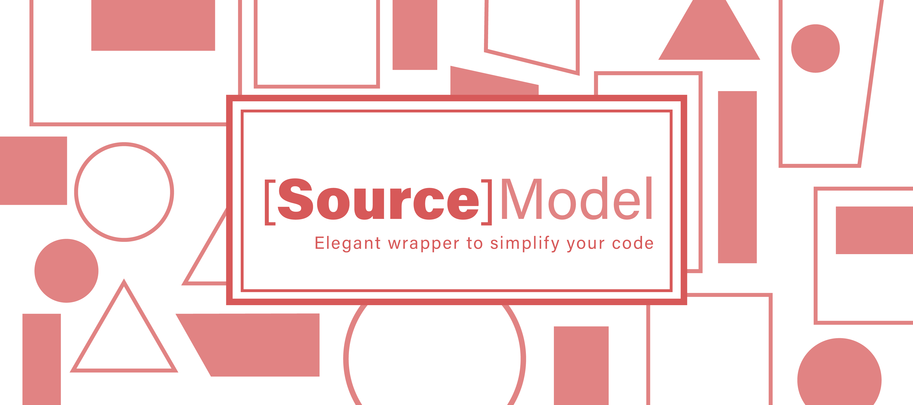

[]()
[]() 
[](https://codeclimate.com/github/stanwood/SourceModel_iOS/maintainability)
[](https://travis-ci.org/stanwood/SourceModel_iOS)

**SourceModel** is a _lightweight_ wrapper for `UICollectionViewDataSource/Delegate` and `UITableViewDataSource/Delegate`. It removes the burden of writing the boiler plate code when working with `tableViews` and `collectionViews`, allowing you to focus on what's important, populating the cells with data. 

**SourceModdel** focus on _Seperation of Concern_, where the cell should only be accessible to get the data to present and decide how to present it. The `dataSource` should not be responsible for deciding how the cell should populate its data, nor know about the view.  

## Usage

Let's jump into some of the protocols you need to be familiar with, to get started. Let's think of a view, that shows products:

### `ModelCollection` protocol

`ModelCollection` represent a collection of similar items, the products in our case.

```swift
public protocol ModelCollection {
    
    /// Returns the number of items
    var numberOfItems: Int { get }
    
    /// Returns the number of sections
    var numberOfSections: Int { get }
    
    /// A subscript to return a type in an indexPath
    subscript(indexPath: IndexPath) -> Model? { get }
    
    /// A subscript to return a collection dataType within a section
    subscript(section: Int) -> ModelCollection { get }
    
    /// Returns the cell type at indexPath
    func cellType(forItemAt indexPath: IndexPath) -> Fillable.Type?
}
```

### `Model` protocol

`Model` represents a single item in a collection of item, a product.

### Both in action

Let's create a collection of items to see it in action:

>We will dive into the `Fillable` protocol in a later stage, for now, let's assume we have a `ProductCell`.

```swift

struct Product { ... }

struct Products: ModelCollection {
    
    let items: [Product]
    
    var numberOfItems: Int {
    	return items.count
    }
    
    var numberOfSections: Int { 
    	return 1
    }
    
    subscript(indexPath: IndexPath) -> Model? { 
    	return items[indexPath.row] 
    }
    
    subscript(section: Int) -> ModelCollection { 
    	return self 
    }
    
    func cellType(forItemAt indexPath: IndexPath) -> Fillable.Type? {
    	return ProductCell.self
    }
}
```

Ok, this is cool, but we can make it even simpler. `SourceModel` offers an `Elements` class that wrapps the above, where you only need to take care of the cells. This is how it works:

```
class Products: Elements<Product>, Codable {
   func cellType(forItemAt indexPath: IndexPath) -> Fillable.Type? {
    	return ProductCell.self
    }
}
```

Now that we we finalised our collection, let's create an instance of `Products`:

```swift
let products = Products(items: [Product(), Product()])
```

### `Fillable` protocol

Each cell must conform to the `Fillable` protocol. This is where your model is injected, and where you will populate the cell. 

```swift
class ProductCell: UICollectionViewCell, Fillable {

	....
	
	func fill(with model: Model?) {
		guard let product = model as? Product else { return }
		
		/// Handle product
	}
}
```


### Preparing the DataSource and Delegate

Now that we have the model, modelCollection, and the cell, let's create the `DataSource` and `Delegate`

```swift
class ProductsViewController: UIViewController {
   
   var dataSource: CollectionDataSource! /// Use TableDataSource for UITableView
   var delegate: CollectionDelegate! /// Use TableDelegate for UITableView
   
   let products = Products(items: [Product(), Product()])
   
   override func viewDidLoad() {
      super.viewDidLoad()
      setupCollectionView(with: products)
   }
   
   private func setupCollectionView(with modelCollection: ModelCollection?)
      delegate = CollectionDataSource(modelCollection: modelCollection)
      dataSource = CollectionDelegate(modelCollection: modelCollection)
        
      collectionView.register(cellType: ProductCell.self)
        
      collectionView.delegate = delegate
      collectionView.dataSource = dataSource
   }
}
```

>Note: To get the `register(cellType:)` function, add [StanwoodCore](https://github.com/stanwood/Stanwood_Core_iOS) to your project.

That's it! 😊

You are probably wondering where to go from here? Let's look at a more complex cases, and how `SourceModel` can help you.

### Working with `Sections`

Working with sections can be a tedious task. You can use `ModelCollection` and inject a collection of sections (other `ModelCollection`s). Alternatively, `SourceModel` offers [Sections](/SourceModel/Sections). Let's look at our `Products` elements from before, and migrate it to sections of different product categories

```swift

class ProductsViewController: UIViewController {
   
   var dataSource: CollectionDataSource! /// Use TableDataSource for UITableView
   var delegate: CollectionDelegate! /// Use TableDelegate for UITableView
   
   let sections: Sections!
   
   override func viewDidLoad() {
      super.viewDidLoad()
      
      let beautyProducts = Products(items: [Product(), Product()])
	   let groceryProducts = Products(items: [Product(), Product()])
	   
	   sections = Sections(sections: [beautyProducts, groceryProducts])
      setupCollectionView(with: products)
   }
   
   private func setupCollectionView(with modelCollection: ModelCollection?)
      delegate = CollectionDataSource(modelCollection: modelCollection)
      dataSource = CollectionDelegate(modelCollection: modelCollection)
        
      collectionView.register(cellType: ProductCell.self)
        
      collectionView.delegate = delegate
      collectionView.dataSource = dataSource
   }
}
```

### Working with `Headers`

If you want to add a section header, make sure you `ModelCollection` conforms to `Headerable`. You have a couple of optional options, depending weather you are populating a `collectionView` or a `tableView`.

**Headerable**

```swift
/// Headerable protocol to add header support for `UICollectionView` and `UITableView`
@objc public protocol Headerable {
    
    /// `UITableView` section header view
    @objc optional var headerView: UIView { get }
    
    /// `UICollectionView` header reusable header view
    @objc optional var reusableView: UICollectionReusableView { get }
}
```

**Example**

Let's take our `Products` and add a header

```swift
class Products: Elements<Product>, Codable, Headerable {
   
   var headerView: UIView { 
   		let view = CategoryHeaderView.loadFromNib()
       view?.backgroundColor = .clear
       view?.set(title: title)
       return view ?? UIView()
   }
   ...
}
```

>Note: To get the `loadFromNib()` function, add [StanwoodCore](https://github.com/stanwood/Stanwood_Core_iOS) to your project

**Important!**

> Known issue: At this stage, `ModelCollection` does not support reusable header views. This is under development. To avoid any memory issues, you should use `Headerable` only for a single header view.

### Implementing `Delegate` pattern

To work with the _Delegate Design Pattern_, **SourceModel** offers a `Delegateable` protocol. Let's see how that works with our `ProductCell`:

**Example: Cell**

```swift
protocol ProductCellDelegate: class {
	func productCellDidDoSomething(with product: Product)
}

/// Conform to `Delegateable`
class ProductCell: UICollectionViewCell, Fillable, Delegateable {

	private weak var delegate: ProductCellDelegate?
	
	....
	
	/// Set the delegate
	func set(delegate: AnyObject) {
		self.delegate = delegate as? ProductCellDelegate
	}
	
	@IBAction didTapSomeButton(_ sender: UIButton) {
	   delegate?. productCellDidDoSomething(with: product)
	}
}
```

***Example: ViewController*

```swift
class ProductsViewController: UIViewController {
   
   var dataSource: CollectionDataSource! /// Use TableDataSource for UITableView
   var delegate: CollectionDelegate! /// Use TableDelegate for UITableView
   
   let products = Products(items: [Product(), Product()])
   
   override func viewDidLoad() {
      super.viewDidLoad()
      setupCollectionView(with: products)
   }
   
   private func setupCollectionView(with modelCollection: ModelCollection?)
   
      delegate = CollectionDataSource(modelCollection: modelCollection)
      
      /// Inject `self` as the delegate
      dataSource = CollectionDelegate(modelCollection: modelCollection, delegate: self)
        
      collectionView.register(cellType: ProductCell.self)
        
      collectionView.delegate = delegate
      collectionView.dataSource = dataSource
   }
}

extension ProductsViewController: ProductCellDelegate {
	
	func productCellDidDoSomething(with product: Product) {
		/// Do something with product
	}
}
```

### Working with cell index's

In some cases, we require to know at what index the cell is positioned. Conform to `Indexable` protocol to get the index.

**Example**

```swift
class ProductCell: UICollectionViewCell, Fillable, Indexable {
	
	....
	
	func inject(_ indexPath: IndexPath) {
		/// Do something with the index
	}
}

```

## Roadmap

- [x] Adding support for `delegate` patter
- [x] Adding support for `headers`
- [x] Adding `Indexable` protocol to inject the `indexPath` into the cell
- [ ] Adding a `reloadData(animated:)` that reloads the models that changed
- [ ] Adding generics to `Fillable` protocol
- [ ] Adding reusable `Header/Footer` view
- [ ] Adding `SwiftUI` support
- [ ] Adding `Combine` support

> Please open an issue for feature requests.

## Example

To run the example project, clone the repo, and run `pod install` from the Example directory first.

## Requirements

## Installation

SourceModel is available through [CocoaPods](https://cocoapods.org). To install
it, simply add the following line to your Podfile:

```ruby
pod 'SourceModel'
```

## Author

Tal Zion, tal.zion@stanwood.de

## License

SourceModel is available under the MIT license. See the LICENSE file for more info.


